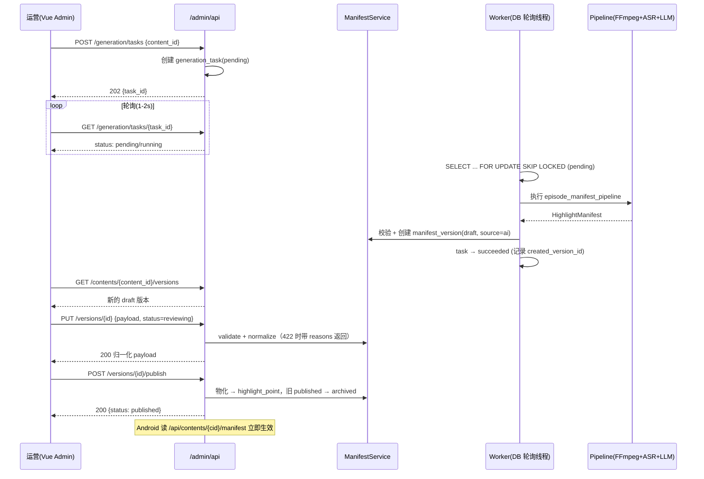
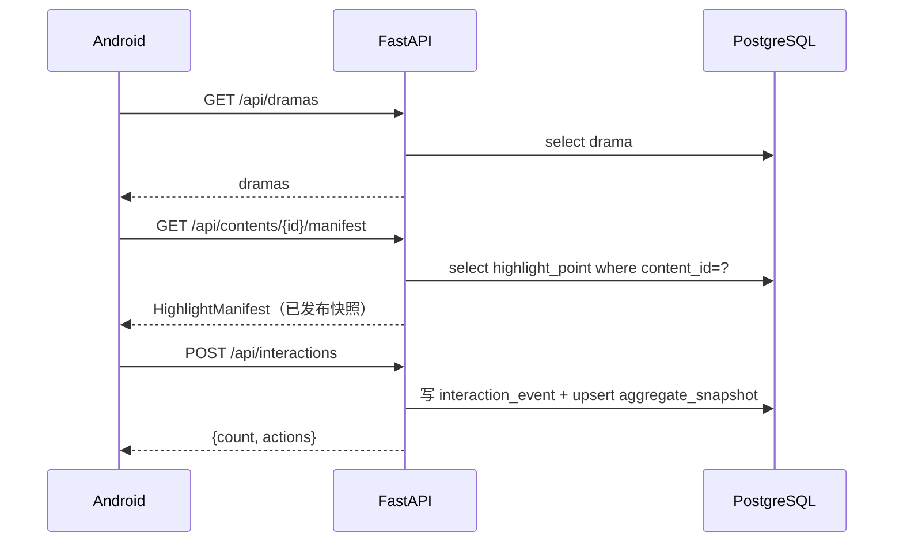

# 管理端 API 设计（/admin/api）

> 面向"短剧互动内容运营平台"的管理接口设计。与现有公开 API（`/api/*`、`/videos/*`、`/posters/*`）完全隔离，
> 客户端读路径零改动。V1 范围：内容管理 + Manifest 编辑器 + AI 生成任务；分析（V3）与 RBAC（V4）在文末标注为暂缓。

## 1. 认证与约定

### 1.1 认证（V1：Admin Token，非 JWT）

```http
Authorization: Bearer <ADMIN_TOKEN>
```

- `ADMIN_TOKEN` 从环境变量读取（`server/.env.server.example` 新增一项），不进代码库。
- 校验用 `secrets.compare_digest`，避免时序侧信道。
- 所有 `/admin/api/*` 路由统一挂 `require_admin` 依赖（FastAPI `Depends`）；V4 升级 RBAC 时只改这一个依赖的签名，路由零改动。

```python
# app/api/admin/auth.py（示意）
def require_admin(authorization: str = Header(default="")) -> None:
    expected = os.getenv("ADMIN_TOKEN", "")
    if not expected or not authorization.startswith("Bearer "):
        raise HTTPException(401, detail="Admin token required")
    if not secrets.compare_digest(authorization.removeprefix("Bearer ").strip(), expected):
        raise HTTPException(401, detail="Invalid admin token")
```

可选：`X-Admin-Operator: <昵称>` 头用于审计日志记录操作者，缺省记 `admin`。

### 1.2 通用约定

| 项 | 约定 |
|---|---|
| Base URL | `/admin/api` |
| 内容类型 | `application/json`（管理端不需要媒体流） |
| 分页 | `?page=1&page_size=20`，响应 `{items, total, page, page_size}` |
| 错误格式 | `{"detail": {"message": "...", "reasons": [...]}}`；校验类错误附 `reasons` 明细 |
| 状态码 | `200` 成功 / `201` 创建 / `202` 任务已受理 / `400` 参数错误 / `401` 未认证 / `404` 不存在 / `409` 状态冲突 / `422` 校验失败 |

### 1.3 校验单一入口

所有写入口（AI 生成结果、人工编辑、发布前）统一调用 `ManifestService`：

```text
payload ──► parse_model_manifest（结构校验）
        ──► normalize_manifest（白名单：type/template/tone/icon、时间窗 2-8s、文案质量）
        ──► 通过则返回归一化后的 payload；不通过返回 422 + 逐条 reasons
```

AI 与人工绝不走两套校验。

## 2. 端点总览

| 方法 | 路径 | 说明 | 阶段 |
|---|---|---|---|
| `GET` | `/dramas` | 管理端剧集列表（含剧集数/已发布数/互动量） | V1 |
| `GET` | `/episodes?drama_id=` | 剧集列表（含 manifest 状态、高光数、互动数） | V1 |
| `GET` | `/episodes/{content_id}` | 剧集详情 + 版本列表摘要 | V1 |
| `GET` | `/contents/{content_id}/versions` | Manifest 版本列表（draft/reviewing/published/archived） | V1 |
| `GET` | `/contents/{content_id}/versions/{version_id}` | 版本详情（完整 payload + 审计线索） | V1 |
| `PUT` | `/contents/{content_id}/versions/{version_id}` | 更新版本 payload（校验+归一化） | V1 |
| `POST` | `/contents/{content_id}/versions/{version_id}/publish` | 发布（物化到 highlight_point） | V1 |
| `POST` | `/contents/{content_id}/versions/{version_id}/rollback` | 回滚到指定历史版本 | V1.5 |
| `POST` | `/generation/tasks` | 触发生成任务（AI 流水线） | V2 |
| `GET` | `/generation/tasks` | 任务列表（分页/状态过滤） | V2 |
| `GET` | `/generation/tasks/{task_id}` | 任务详情（前端轮询用） | V2 |
| `POST` | `/generation/tasks/{task_id}/retry` | 失败任务重试（failed → pending） | V2 |
| `GET` | `/audit-logs` | 审计日志（分页/按目标过滤） | V1 |
| `POST` | `/scan` | 重新扫描媒体目录（种子语义，不覆盖已发布） | V1 |
| ~~`GET`~~ | ~~`/analytics/...`~~ | ~~互动数据分析~~ | V3 暂缓 |
| ~~`POST`~~ | ~~`/auth/login`~~ | ~~JWT 登录~~ | V4 暂缓 |

## 3. 详细接口

### 3.1 内容管理

#### `GET /admin/api/dramas`

管理端剧集列表。

```json
200 OK
[
  {
    "id": 1001,
    "title": "都市赘婿",
    "poster": "http://127.0.0.1:3000/posters/...",
    "tags": ["local", "demo"],
    "episode_count": 12,
    "published_count": 8,
    "total_interactions": 2345
  }
]
```

#### `GET /admin/api/episodes?drama_id=1001&page=1&page_size=20`

剧集列表，核心是 `manifest_status` 让运营一眼看到"哪集还没高光/审核到哪了"。

```json
200 OK
{
  "items": [
    {
      "id": 1001001,
      "content_id": "2fe8f92ec371216d",
      "episode_index": 1,
      "title": "第01集",
      "video_url": "http://127.0.0.1:3000/videos/...",
      "duration_ms": 300000,
      "manifest_status": "published",      // none | draft | reviewing | published
      "highlight_count": 4,
      "interaction_count": 892,
      "updated_at": "2026-06-01T12:00:00Z"
    }
  ],
  "total": 12,
  "page": 1,
  "page_size": 20
}
```

#### `GET /admin/api/episodes/{content_id}`

剧集详情 + 版本列表摘要（编辑器打开页面的一次性数据）。

```json
200 OK
{
  "episode": {
    "id": 1001001,
    "content_id": "2fe8f92ec371216d",
    "episode_index": 1,
    "title": "第01集",
    "video_url": "http://127.0.0.1:3000/videos/...",
    "duration_ms": 300000
  },
  "versions": [
    {
      "id": 3,
      "status": "published",
      "source": "ai_edited",
      "highlight_count": 4,
      "created_at": "...", "updated_at": "...", "published_at": "..."
    },
    {
      "id": 4,
      "status": "reviewing",
      "source": "ai_edited",
      "highlight_count": 5,
      "created_at": "...", "updated_at": "...", "published_at": null
    }
  ]
}
```

### 3.2 Manifest 编辑器（核心）

#### `GET /admin/api/contents/{content_id}/versions`

```json
200 OK
{
  "items": [
    {
      "id": 4,
      "content_id": "2fe8f92ec371216d",
      "status": "reviewing",
      "source": "ai_edited",
      "highlight_count": 5,
      "created_at": "...", "updated_at": "...", "published_at": null
    }
  ],
  "total": 4,
  "page": 1,
  "page_size": 20
}
```

#### `GET /admin/api/contents/{content_id}/versions/{version_id}`

返回完整 payload（编辑器渲染用）+ 该版本最近的审计记录。

```json
200 OK
{
  "id": 4,
  "content_id": "2fe8f92ec371216d",
  "status": "reviewing",
  "source": "ai_edited",
  "payload": {
    "content_id": "2fe8f92ec371216d",
    "version": "0.2.0",
    "highlights": [
      {
        "id": "hl-2fe8f92ec371216d-001",
        "start_ms": 12000,
        "end_ms": 18000,
        "type": "twist",
        "intensity": 0.9,
        "template": "dual-button",
        "payload": {
          "title": "身份曝光",
          "actions": [
            {"key": "shuang", "label": "爽", "tone": "positive", "icon": "fire"},
            {"key": "laughed", "label": "笑出声", "tone": "funny", "icon": "laugh"}
          ],
          "effect": "ratio-reveal"
        }
      }
    ]
  },
  "created_at": "...", "updated_at": "...", "published_at": null
}
```

#### `PUT /admin/api/contents/{content_id}/versions/{version_id}`

更新版本。**只允许改 draft/reviewing 状态**；published 版本不可改（要改先建新版本）。服务端校验 + 归一化，返回归一化后的 payload。

```json
// Request
{
  "payload": { "content_id": "...", "version": "0.2.0", "highlights": [...] },
  "status": "reviewing"      // 可选：draft / reviewing
}

// 200 OK
{
  "id": 4,
  "content_id": "2fe8f92ec371216d",
  "status": "reviewing",
  "source": "ai_edited",
  "payload": { "...": "归一化后的完整 payload" },
  "updated_at": "..."
}

// 422 校验失败
{
  "detail": {
    "message": "Manifest validation failed",
    "reasons": [
      "hl-...-001: highlight time window must be 2-8 seconds",
      "hl-...-002: highlight type is not allowlisted"
    ]
  }
}
```

#### `POST /admin/api/contents/{content_id}/versions/{version_id}/publish`

发布：物化 payload → `highlight_point`（复用 `_upsert_manifest`），当前 published → archived，写审计日志。**发布前再次全量校验**（防止绕过 PUT 直接发布非法数据）。

```json
// 200 OK
{
  "version_id": 4,
  "content_id": "2fe8f92ec371216d",
  "status": "published",
  "published_at": "...",
  "highlight_count": 5,
  "replaced_version_id": 3
}

// 409 状态冲突（非 draft/reviewing 不可发布）
// 422 校验失败（同 PUT）
```

**幂等**：同一版本重复 publish 不产生重复数据（upsert 语义），可安全重试。

#### `POST /admin/api/contents/{content_id}/versions/{version_id}/rollback`（V1.5）

把任意历史版本重新发布（当前 published → archived），写审计日志。

```json
// 200 OK
{ "version_id": 2, "status": "published", "published_at": "...", "replaced_version_id": 4 }
```

### 3.3 AI 生成任务

#### `POST /admin/api/generation/tasks`

触发生成。三选一标识目标视频（推荐传 `content_id`，服务端反查路径）。

```json
// Request（三选一）
{ "content_id": "2fe8f92ec371216d" }
{ "episode_id": 1001001 }
{ "relative_path": "都市赘婿/第01集.mp4" }

// 202 Accepted
{ "task_id": 42, "status": "pending", "content_id": "2fe8f92ec371216d" }
```

约束：该 content_id 已存在 pending/running 任务时返回 `409`（避免重复触发）。

#### `GET /admin/api/generation/tasks?status=pending&page=1&page_size=20`

```json
200 OK
{
  "items": [
    {
      "id": 42,
      "content_id": "2fe8f92ec371216d",
      "episode_id": 1001001,
      "relative_path": "都市赘婿/第01集.mp4",
      "status": "running",            // pending | running | succeeded | failed
      "retry_count": 0,
      "max_retry": 3,
      "error_message": null,
      "created_version_id": null,     // 成功后自动创建的 draft 版本
      "created_at": "...", "finished_at": null
    }
  ],
  "total": 1, "page": 1, "page_size": 20
}
```

#### `GET /admin/api/generation/tasks/{task_id}`

前端轮询用（建议 1-2s 间隔）。任务成功后响应带 `created_version_id`，前端直接跳转编辑器。

```json
200 OK
{
  "id": 42, "content_id": "...", "status": "succeeded",
  "retry_count": 0, "max_retry": 3,
  "error_message": null,
  "created_version_id": 4,
  "finished_at": "..."
}
```

#### `POST /admin/api/generation/tasks/{task_id}/retry`

仅 failed 可重试（`retry_count < max_retry` 时自动恢复，此接口用于人工触发重试）。

```json
// 202 Accepted
{ "task_id": 42, "status": "pending", "retry_count": 1 }
```

### 3.4 审计与运维

#### `GET /admin/api/audit-logs?target_type=manifest_version&target_id=4&page=1`

```json
200 OK
{
  "items": [
    {
      "id": 1024,
      "operator": "admin",
      "operation": "publish",
      "target_type": "manifest_version",
      "target_id": "4",
      "before_json": {"status": "reviewing"},
      "after_json": {"status": "published", "published_at": "..."},
      "created_at": "..."
    }
  ],
  "total": 3, "page": 1, "page_size": 20
}
```

#### `POST /admin/api/scan`

重新扫描媒体目录（`store.reload()`）。**source of truth 规则（强制）**：线上唯一事实来源是 `highlight_point`（只由 publish 写入）；磁盘 Manifest 仅是**初始种子**——content_id 已有 published 版本的，跳过磁盘 Manifest 覆盖（含重启 reload），磁盘旧 JSON 永远不能冲掉人工审核后的线上内容。新剧集/新剧集文件会入库。

```json
// 200 OK
{
  "ok": true,
  "dramas_scanned": 3,
  "episodes_scanned": 36,
  "new_episodes": 2
}
```

## 4. 关键流程时序

### 4.1 AI 生成 → 审核 → 发布（Human-in-the-loop）



### 4.2 客户端读路径（零改动，对照）



## 5. 分层与实现映射

```text
app/api/admin/           路由层（薄）：router 只做参数解析 + 调 service
  auth.py                require_admin 依赖
  content.py             dramas/episodes/versions/publish/rollback
  generation.py          tasks 的创建/查询/重试
  audit.py               audit-logs
app/services/
  manifest_service.py    内部拆两个组件：
    ManifestValidator    校验/归一化（复用 parse_model_manifest + normalize_manifest，422 带 reasons）
    ManifestPublisher    发布编排（校验 → 物化 highlight_point → 版本状态流转 → 审计日志）
  generation_service.py  任务创建/领取/回收/重试编排
app/repositories/
  admin_repository.py    聚合查询：GROUP BY / COUNT / JOIN / 分页（不塞进 Store）
app/worker.py            后台线程：轮询 pending → 调 episode_manifest_pipeline
```

**ManifestService 内部职责划分**：`ManifestValidator` 只做"输入合法吗、归一化后是什么"（纯函数，可单测）；`ManifestPublisher` 只做"把合法版本发布到线上"（写库 + 状态流转 + 审计）。路由只调用 `ManifestService` 的门面方法（`validate / update / publish / rollback`），不直接触达两个内部组件——拆分是为了可测试性与职责清晰，对外仍是单一入口。

**红线**：`normalize_manifest` / `parse_model_manifest` 只存在于 services 层，repositories 只做存取，路由不做任何业务判断——杜绝 500 行 router 和"AI 过校验、人工不过校验"的规则分裂。

## 6. 管理端前端（client_admin/）

Vue3 + Vite + Element Plus + Vue Router（hash 路由），axios 统一附加 `Authorization: Bearer <token>` 与 `X-Admin-Operator`。

| 页面 | 路由 | 说明 |
|---|---|---|
| 登录 | `#/login` | 输入 ADMIN_TOKEN + 操作者昵称（存 localStorage，无后端登录接口） |
| 内容管理 | `#/dramas` | 短剧列表（剧集数/已发布数/互动量） |
| 剧集列表 | `#/episodes?drama_id=` | manifest 状态标签 + 高光数 + 互动数，入口：编辑器 / 生成高光 |
| Manifest 编辑器 | `#/editor/{content_id}` | 视频 + 时间轴 + 高光卡片编辑 + 版本管理（新建草稿/保存/发布/回滚） |
| AI 生成任务 | `#/tasks` | 选剧集触发任务、3s 自动刷新、失败重试、成功后直达草稿 |
| 审计日志 | `#/audit` | 按目标过滤，展开查看 before/after JSON |

**本地开发**（后端 3000 端口跑着）：

```powershell
cd client_admin
npm install
npm run dev        # http://localhost:5173/admin/  （/admin/api、/videos、/posters 已代理到 3000）
```

**生产构建**（FastAPI 自动挂载 `/admin`）：

```powershell
cd client_admin
npm install && npm run build     # 产物输出 dist/
# FastAPI 启动时检测到 client_admin/dist/index.html 即挂载 /admin
```

**容器部署**：`server/Dockerfile` 已改为多阶段构建（Stage 1 用 node:20 构建 UI，Stage 2 把产物 COPY 进 API 镜像的 `admin_dist/`），`docker compose -f docker-compose.server.yml up -d --build` 一步到位，管理端与 API 同端口（`http://服务器IP:3000/admin/`）。

### 集成验证

`server/tests/integration_test.py`：真实 PostgreSQL + 真实素材目录的端到端验证（47 项断言：认证 / 版本流 / 发布 / 部分唯一索引 / 回滚 / scan 种子语义 / 生成任务 / 审计 / 客户端互动链路）。Postgres 不可用时自动跳过：

```powershell
docker compose up -d postgres
python tests\integration_test.py     # 需要 server/.venv，素材目录默认 ../drama
```

> 集成测试在真实链路上抓出并修复过三个问题：发布/回滚时旧版本未先归档导致违反部分唯一索引（已加 `session.flush()` 保证状态转换顺序）、重复发布非幂等（已发布版本重复 publish 直接返回当前状态）、`manifest_status` 未按 published 优先取（回滚后列表误显示 archived）。

## 7. 阶段范围（按价值排序）

| 阶段 | 内容 | 本设计中的范围 |
|---|---|---|
| **V1（必须）** | 内容管理 + Manifest 编辑器 + 发布 + 审计 | 3.1 / 3.2 / 3.4 全部，`manifest_version` + `admin_operation_log` 表 |
| **V2（必须）** | AI 生成工作台 + 任务系统 | 3.3 全部，`generation_task` 表 + worker |
| **V3（暂缓）** | 互动数据分析（参与率/排行/趋势） | 新增 `/analytics/*`，聚合查询走 admin_repository |
| **V4（暂缓）** | 系统管理：RBAC/JWT/独立 worker 容器 | `require_admin` 升级，`docker-compose.server.yml` 加 worker service |
