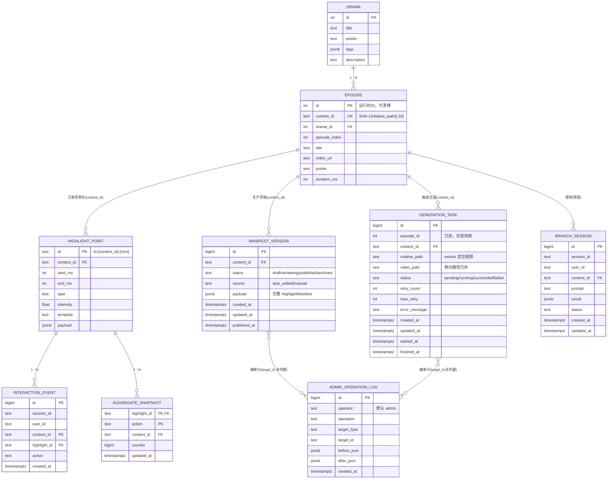

# 数据库设计（内容生产层）

> 面向"短剧互动内容运营平台"的数据模型设计。核心原则：**线上读路径零改动，内容生产层独立**。
> 现有客户端链路 `Android → /api/... → highlight_point` 完全保持；新增的三张表只服务于"AI 生产 → 人工审核 → 发布"的内容生产闭环。

## 1. 设计原则

1. **运行时数据与生产态数据分离**：`highlight_point` 描述"线上此刻该触发什么互动"，`manifest_version` 描述"内容生产过程中的中间状态"。二者生命周期不同，绝不混在同一张表里。
2. **发布态是不可变快照**：一次发布 = 一个完整的 `payload`（整份 Manifest）物化到线上表；编辑态是 JSON Document，发布态是 Immutable Snapshot（Git: working tree → commit → release）。
3. **单一校验入口**：AI 生成、人工编辑、导入文件，所有入口统一走 `ManifestService.validate()/normalize()`，杜绝规则分裂。
4. **`content_id` 是全局稳定主关联**（相对路径 SHA-1 前 16 位），`episode.id` 是会漂移的运行时 ID，仅作查询便利冗余。
5. **at-least-once + 幂等**：任务系统允许重复执行，幂等性由发布 upsert 兜底。
6. **状态字段一律带 DB CHECK 约束**：`status` / `task_type` / `source` / `target_type` 等枚举字段在数据库层用 CHECK 约束锁定取值，与应用层白名单构成双保险（应用层负责给出可读错误，DB 层负责兜底防脏数据）。
7. **线上 source of truth 是 `highlight_point`（仅由发布写入）**：磁盘 Manifest 目录只是"初始种子"，仅在对应 content_id 尚无 published 版本时生效；已发布的线上内容绝不被磁盘扫描覆盖。

## 2. ER 图



## 3. 表结构

### 3.1 既有表（保持不变，不赘述）

`drama` / `episode` / `highlight_point` / `interaction_event` / `aggregate_snapshot` / `branch_session`
（完整定义见 [server/db/schema.sql](../server/db/schema.sql)）

### 3.2 新增：`manifest_version` —— 内容生产版本表（核心）

```sql
CREATE TABLE manifest_version (
    id           BIGSERIAL PRIMARY KEY,
    content_id   TEXT NOT NULL REFERENCES episode(content_id),
    status       TEXT NOT NULL DEFAULT 'draft'
                 CONSTRAINT ck_manifest_version_status
                 CHECK (status IN ('draft', 'reviewing', 'published', 'archived')),
    source       TEXT NOT NULL DEFAULT 'ai'
                 CONSTRAINT ck_manifest_version_source
                 CHECK (source IN ('ai', 'ai_edited', 'manual')),
    payload      JSONB NOT NULL,            -- 完整 HighlightManifest（含 highlights[]）
    created_at   TIMESTAMPTZ NOT NULL DEFAULT CURRENT_TIMESTAMP,
    updated_at   TIMESTAMPTZ NOT NULL DEFAULT CURRENT_TIMESTAMP,
    published_at TIMESTAMPTZ
);

-- 每个 content_id 最多一个 published 版本（部分唯一索引）
CREATE UNIQUE INDEX uq_manifest_version_published
    ON manifest_version (content_id) WHERE status = 'published';
-- 列表查询
CREATE INDEX ix_manifest_version_content
    ON manifest_version (content_id, status, id DESC);
```

**为什么是"整份 payload"而不是拆行存高光**：编辑态是文档，一次编辑 = 一个版本 = 一份完整 JSON。拆行会引入"半发布"混合状态（你担心的"改一半线上就看到错误数据"），且未来加 `template / asset / animation / copy / A-B experiment` 配置时，文档快照天然可回滚，拆表则越来越难。

**状态机**：

```text
AI生成 ──► draft ──► reviewing ──► published ──(被新版本顶替)──► archived
             ▲           │
             └───────────┘        （编辑中任意回退到 draft）
```

**发布语义**：把 `payload` 物化进 `highlight_point`（复用现有 `DatabaseStore._upsert_manifest` 的增删/聚合清理逻辑），当前 published 版本置为 `archived`，记录审计日志。客户端读路径 `/api/contents/{id}/manifest` 零改动。

**回滚语义**：选择任意 archived/published 版本 → 直接重新发布该版本（当前 published → archived），或先拷贝为 draft 再走审核流。两种都记录审计日志。

### 3.3 新增：`generation_task` —— AI 生成任务表

```sql
CREATE TABLE generation_task (
    id            BIGSERIAL PRIMARY KEY,
    episode_id    INTEGER,                  -- 冗余，便于按剧集查询（运行时 ID，可漂移）
    content_id    TEXT NOT NULL REFERENCES episode(content_id),
    relative_path TEXT NOT NULL,            -- worker 定位视频文件的唯一可靠依据
    video_path    TEXT NOT NULL,            -- 绝对路径冗余（快照当时的值）
    task_type     TEXT NOT NULL DEFAULT 'manifest_generate'
                  CONSTRAINT ck_generation_task_type
                  CHECK (task_type IN ('manifest_generate', 'continuation')),
    status        TEXT NOT NULL DEFAULT 'pending'
                  CONSTRAINT ck_generation_task_status
                  CHECK (status IN ('pending', 'running', 'succeeded', 'failed')),
    retry_count   INTEGER NOT NULL DEFAULT 0,
    max_retry     INTEGER NOT NULL DEFAULT 3,
    error_message TEXT,
    created_version_id BIGINT,        -- 成功后自动创建的 draft 版本 id（任务 → 版本 的桥梁）
    created_at    TIMESTAMPTZ NOT NULL DEFAULT CURRENT_TIMESTAMP,
    updated_at    TIMESTAMPTZ NOT NULL DEFAULT CURRENT_TIMESTAMP,
    started_at    TIMESTAMPTZ,
    finished_at   TIMESTAMPTZ
);

CREATE INDEX ix_generation_task_status ON generation_task (status, created_at);
CREATE INDEX ix_generation_task_content ON generation_task (content_id);
```

**`task_type` 说明**：V1/V2 只用 `manifest_generate`（高光 Manifest 生成）；`continuation`（剧情续写任务）为预留枚举，接入 `continuation_generator` 时直接复用任务状态机，无需改表。

**为什么必须存 `relative_path`**：`content_id = SHA1(relative_path)` 是**单向映射**（path → id），id → path 不存在。任务只存 content_id，worker 无法还原要处理哪个视频。三个字段都存：`episode_id` 查得方便、`content_id` 稳定关联、`relative_path` 给 worker 用，空间成本可忽略。

**状态机**：

```text
              ┌────────────┐
              ▼            │ retry_count < max_retry
pending ──► running ──► failed
              │            │
              ▼            └─────────► failed(终态, 人工重试/放弃)
           succeeded
              │
              ▼
     创建 manifest_version(draft, source=ai)
```

**孤儿回收（worker 启动时）**：把 `status='running' AND updated_at < now() - 过期阈值` 的任务重置回 `pending`。语义从"重启任务消失"变成"任务最多重复执行一次"，幂等性由发布 upsert 兜底。

**任务领取必须是 DB 原子操作**：

```sql
SELECT * FROM generation_task
WHERE status = 'pending'
ORDER BY id
LIMIT 1
FOR UPDATE SKIP LOCKED;
```

（多 worker / 多 uvicorn worker 同时轮询时不会重复领取。）

### 3.4 新增：`admin_operation_log` —— 审计日志表

```sql
CREATE TABLE admin_operation_log (
    id          BIGSERIAL PRIMARY KEY,
    operator    TEXT NOT NULL DEFAULT 'admin',  -- 单 token 部署无身份；前端可传 X-Admin-Operator
    operation   TEXT NOT NULL,                  -- create_version/update_version/publish/rollback/generate/retry/scan
    target_type TEXT NOT NULL                   -- 必填：每次操作必须记录目标类型
                CONSTRAINT ck_admin_log_target_type
                CHECK (target_type IN ('manifest_version', 'generation_task', 'episode', 'drama')),
    target_id   TEXT NOT NULL,                  -- 必填：目标主键（版本 id / 任务 id / content_id / drama id）
    before_json JSONB,
    after_json  JSONB,
    created_at  TIMESTAMPTZ NOT NULL DEFAULT CURRENT_TIMESTAMP
);

CREATE INDEX ix_admin_operation_log_target ON admin_operation_log (target_type, target_id, created_at DESC);
```

**`target_type` + `target_id` 均为必填（NOT NULL）**：审计日志的价值在于"每条操作都能定位到目标对象"，不允许存在无法追溯的悬空记录。`target_type` 取值由 CHECK 约束锁定，杜绝拼写漂移（如 `manifest_version` vs `manifestVersion`）。

记录"谁、何时、对什么、做了什么、改前改后"，答辩叙事：**"内容生产系统需要保证可追溯性"**。实现成本极低（一个依赖注入的写日志函数），收益高。

> 单 `ADMIN_TOKEN` 部署没有用户身份。V1 方案：前端在本地记录操作者昵称，随请求发 `X-Admin-Operator` 头，后端无头时默认 `admin`。V4 上 RBAC 后自然替换为真实身份。

## 4. 关键设计决策与取舍

| 决策点 | 结论 | 理由 |
|---|---|---|
| 线上/生产态分离 | `highlight_point` = 线上快照；`manifest_version` = 生产文档 | 客户端查询无需过滤 status；编辑中的中间态不会泄漏到线上 |
| 版本存储粒度 | 整份 payload JSONB | 可回滚、可扩展模板/资源/实验配置；编辑原子性 |
| 每个 content_id 唯一 published | 部分唯一索引强制 | 数据库层面保证线上只有一份生效 Manifest |
| 任务主键关联 | `relative_path`（必）+ `content_id`（稳）+ `episode_id`（便） | 单向哈希不可逆，worker 靠 relative_path 定位视频 |
| 任务类型扩展 | `task_type` 列 + CHECK（`manifest_generate`/`continuation`） | 续写任务复用同一状态机，无需改表 |
| 枚举取值双保险 | 应用层白名单校验 + DB 层 CHECK 约束 | 应用层给出可读错误（422+reasons），DB 层兜底防脏数据 |
| 任务恢复语义 | at-least-once + 启动孤儿回收 + 幂等 upsert | 不追求 exactly-once（Celery 也做不到），用可重复执行兜底 |
| 领取并发 | `FOR UPDATE SKIP LOCKED` | 多 worker 不重复领取 |
| 发布时被删高光的互动数据 | **V1 物理删除 + 审计日志记录被删 id 清单**；V3 升级为软删除 | 复用现有 `_upsert_manifest`，实现最小；历史分析需求确认后再加 `archived` 列 |
| **线上 source of truth** | **`highlight_point` 是唯一线上事实来源，只由 publish 写入**；磁盘 Manifest 仅是初始种子，仅当 content_id 无 published 版本时生效 | 磁盘旧 JSON 永远不能覆盖人工审核后的线上内容；`/admin/scan` 与重启 reload 均遵守此规则 |
| 校验单一入口 | AI / 人工 / 导入全部走 `ManifestService`（内部拆 validator / publisher 两个组件） | 杜绝"AI 过校验、人工不过校验"的规则分裂 |
| 认证 | V1 `ADMIN_TOKEN`（Bearer）→ V4 JWT + RBAC | 无用户系统前不做登录/刷新/权限依赖 |

## 5. 与既有部署的兼容

- 三张新表由 SQLAlchemy `Base.metadata.create_all` 自动创建，跟随现有"运行时建表"模式；`schema.sql` 同步补充分说明版本。
- `docker-compose.server.yml` 无需改动（V1 worker 以线程跑在 API 进程内；独立 worker 容器是 V4 之后的可选项）。
- 客户端完全无感：`highlight_point` 读路径、`/api/interactions` 上报路径、`aggregate_snapshot` 聚合路径全部不变。
